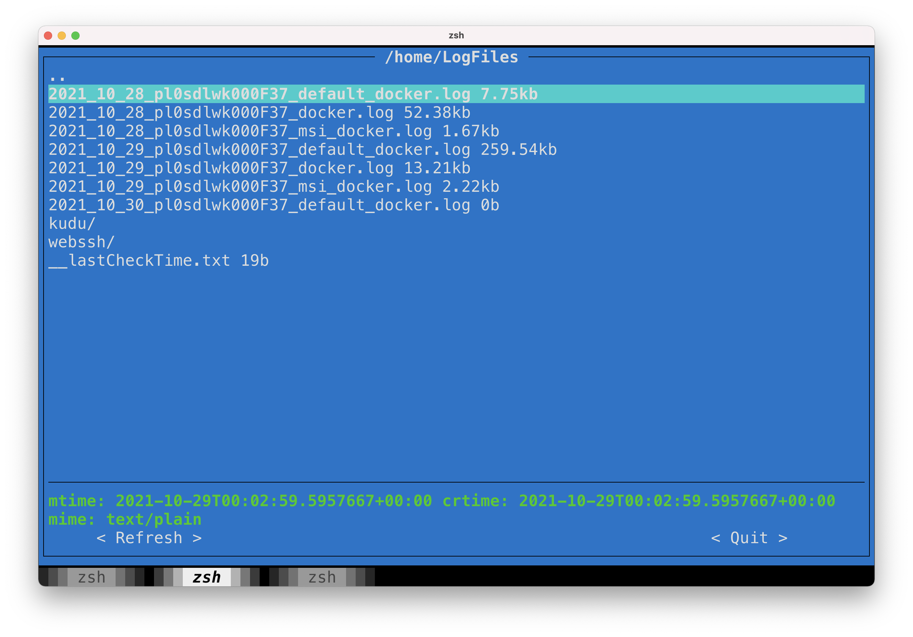
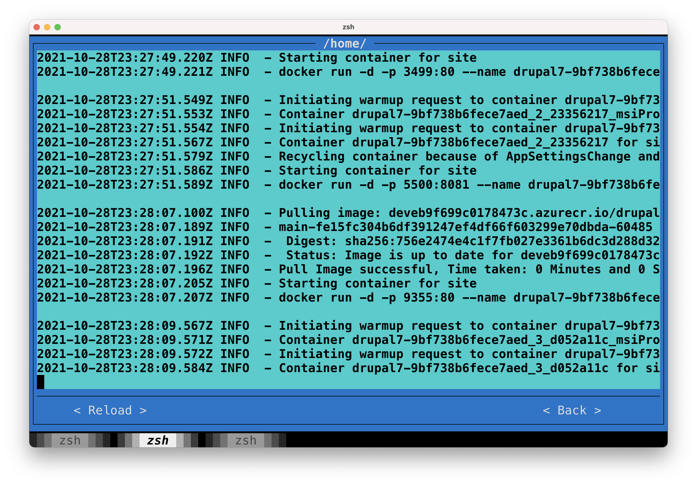

# CLI & TUI to list and view (log) files on Azure DevOps

This is the initial codedump, which 'works on my machine'.

The script has three commands:

`./appservice-filebrowser./py ls PATH` to list a directory (by default, the root dir)
`./appservice-filebrowser./py get PATH` to download a file
`./appservice-filebrowser./py tui` to start an interactive TUI where you can browse through the files.

For usage, run the python file with --help.

## TUI screenshots

## TODO
* Turn into a Python library + installable executables
* Package with Nix
